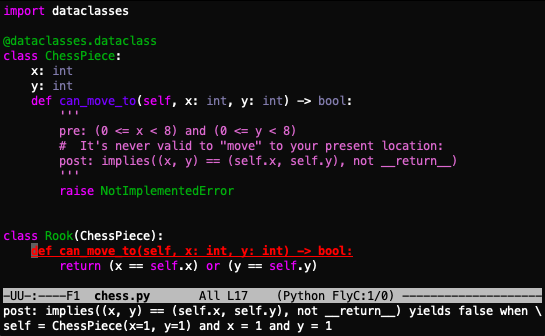
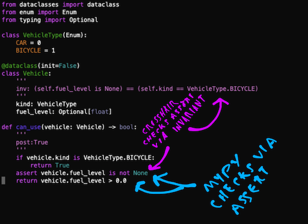

# CrossHair

[](https://travis-ci.org/pschanely/CrossHair)
[](https://gitter.im/Cross_Hair/Lobby?utm_source=badge&utm_medium=badge&utm_campaign=pr-badge&utm_content=badge)

A static analysis tool for Python that blurs the line between testing and type systems.

If you have functions with [type annotations](https://www.python.org/dev/peps/pep-0484/) and add some invariants in the (defunct) [PEP 316](https://www.python.org/dev/peps/pep-0316/) syntax, CrossHair will attempt to find counterexamples for you:


CrossHair works by repeatedly calling your functions with fake symbolic values in an attempt to explore execution paths and find counterexamples.
This is not a new idea; it was first described in [this paper](https://hoheinzollern.files.wordpress.com/2008/04/seer1.pdf).
However, to my knowledge, CrossHair is the most complete implementation of the idea: it has at least some support for (possibly nested) lists, dicts, sets, and custom/mutable objects.

## Why Should I Use CrossHair?

**Verify across all implementations.** Contracts are particularly helpful when applied to base classes / interfaces: all implementations will be verified against them:



**Catch errors.** Setting a trivial postcondition of "True" is enough to enable analysis, which will find exceptions like index bounds errors:


**Support your type checker.** CrossHair is a nice companion to mypy. Assert statements divide the work between the two systems:



**Optimize with Confidence.** Postconditions can demonstrate the equivalence of optimized code to naive code. The invariant not only demonstrates equivalence - it also documents the function's behavior:


## Get Started

> **_NOTE:_**  CrossHair is in a highly experimental state right now. If you're using it, it's because you want it to succeed, want to help, are interested in the tech, or (hopefully) all of the above.

Inside the development environment of the code you want to analyze (virtual environment, conda environment, etc), install:
```shell
pip install git+https://github.com/pschanely/crosshair
```

CrossHair works best when it sits in its own window and thinks about your code while you work on it. Open such a window, activate your development environment, and run:
```shell
crosshair watch [directory with code to analyze]
```
You should then see perodically updating text as CrossHair analyzes the contracts in your code. It will watch for changes as re-analyze as appropriate. When it detects an issue, you'll see something like this:


Hit Ctrl-C to exit.

### IDE Integrations

As mentioned above, CrossHair wants to run in the background. However, IDE integrations can still help by reflecting the results from a concurrent `crosshair watch` directly in your editor.

* [Emacs (flycheck)](https://github.com/pschanely/emacs-flycheck-crosshair)

If you make a plugin for your favorite editor (please do!), we'll link it above. The `crosshair showresults [FILENAME]` command will yield results in the same format as the mypy type checker. (a non-zero exit for for errors, and lines formatted as `{FILENAME}:{LINE_NUMBER}:error:{MESSAGE}`)

## Limitations

A (wildly incomplete) list of present limitations. Some of these will be lifted over time (your help is welcome!); some may never be lifted.

* Automated theorem provers have very different perspectives on hard problems and easy problems than humans.
  * Be prepared to be surprised both by what CrossHair can tell you, and what it cannot.
* Only function and class definitions at the top level are anlyzed. (i.e. not when nested inside other functions/classes)
* Only deteministic behavior can be analyzed. (your code always does the same thing when starting with the same values)
  * In some cases, CorssHair can detect non-determinism and tell you about it.
* Symbolic values are largely implemented as Python proxies. CrossHair monkey-patches the system to maintain a good illusion, but the illusion is not complete:
  * Code that casres about the identity values (x is y) may not be fully analyzable.
  * Code that cares about the types of values may not be fully analyzable.

## Related Work

|Technology|Relation|
|---------:|:-------|
| [dependent types](https://en.wikipedia.org/wiki/Dependent_type), [refinement types](https://en.wikipedia.org/wiki/Refinement_type) | CrossHair aims to provide many of the same capabilities as these advanced type systems. CrossHair is easier to learn (because it is just python), but is incomplete (it can't always tell you whether a condition holds). |
| [design by contract](https://en.wikipedia.org/wiki/Design_by_contract) | Unlike other systems and tools for contracts, CrossHair *statically* attempts to verify pre- and post- conditions. |
| [fuzz testing](https://en.wikipedia.org/wiki/Fuzzing), [concolic testing](https://en.wikipedia.org/wiki/Concolic_testing) | State-of-the-art fuzz testers employ SMT solvers in a similar fashion as CrossHair. |
| [SMT solvers](https://en.wikipedia.org/wiki/Satisfiability_modulo_theories) | Automated theorem provers power many of the technologies in this table. CrossHair uses [Z3](https://github.com/Z3Prover/z3). |
| [angr](https://angr.io), [klee](https://klee.github.io/) | Symbolic execution of binary code. Unlike these tools, CrossHair models the semantics of Python types directly. |
| [PyExZ3](https://github.com/thomasjball/PyExZ3), [pySim](https://github.com/bannsec/pySym), [PEF](https://git.cs.famaf.unc.edu.ar/dbarsotti/pef) | Take approaches that are very similar to CrossHair, in various states of completeness. CrossHair is generally more perscriptive or product-like than these tools. |
